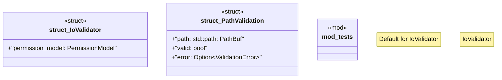

# `crates/ggen-cli/src/validation_lib/io_validator.rs`

Source SHA-256: `c9611ad9a7f332d14d1612fc151f9be0c9562a7ba764d3c4758f3ae8709ad9f7`

## Dependencies

- `crate::validation_lib::error::{Result, ValidationError}`
- `crate::validation_lib::security::{Permission, PermissionModel}`
- `std::fs`
- `std::fs::File`
- `std::io::Write`
- `std::path::Path`
- `super::*`
- `tempfile::tempdir`

## Standing

- Structural parse: `ALIVE`
- Runtime behavior: `UNKNOWN`
