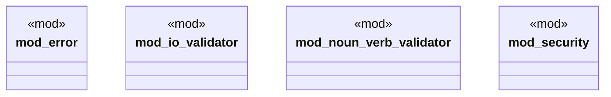

# `crates/ggen-cli/src/validation_lib/mod.rs`

Source SHA-256: `02a7de37b18b8c88ba265599e90e7b593522cd4487df92d4cc5c27164349ca70`

## Dependencies

- `error::ValidationError`
- `io_validator::IoValidator`
- `noun_verb_validator::NounVerbValidator`
- `security::{Permission, PermissionModel}`

## Standing

- Structural parse: `ALIVE`
- Runtime behavior: `UNKNOWN`
