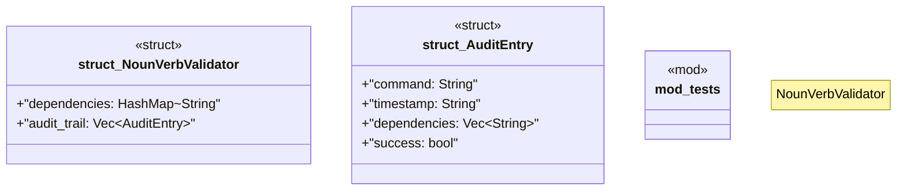

# `crates/ggen-cli/src/validation_lib/noun_verb_validator.rs`

Source SHA-256: `4dc3ef79bd9aea19ea44036dde5a83e34fcc5a16e656caedd09353e1ceb8f787`

## Dependencies

- `crate::validation_lib::error::{Result, ValidationError}`
- `std::collections::{HashMap, HashSet}`
- `super::*`

## Standing

- Structural parse: `ALIVE`
- Runtime behavior: `UNKNOWN`
