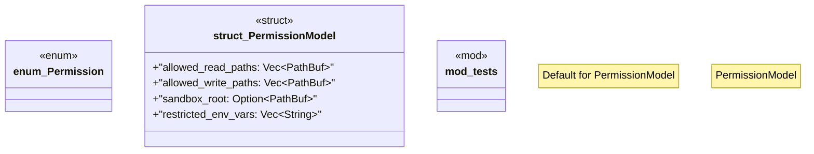

# `crates/ggen-cli/src/validation_lib/security.rs`

Source SHA-256: `86e99a59a6dd81ea61dd86b8bb94830de3a7f4e4539cb153336c57ca5ef7c8b7`

## Dependencies

- `crate::validation_lib::error::{Result, ValidationError}`
- `std::env`
- `std::path::{Path, PathBuf}`
- `super::*`

## Standing

- Structural parse: `ALIVE`
- Runtime behavior: `UNKNOWN`
