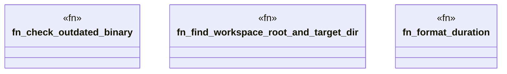

# `crates/ggen-cli/src/version_checker.rs`

Source SHA-256: `a65926a31dffcebdbca68f333f93c2c91bb9841f9eef5709fb1fd6bf18c1200a`

## Dependencies

- `colored::Colorize`
- `std::fs`
- `std::io::IsTerminal`
- `std::path::{Path, PathBuf}`
- `std::time::SystemTime`

## Standing

- Structural parse: `ALIVE`
- Runtime behavior: `UNKNOWN`
