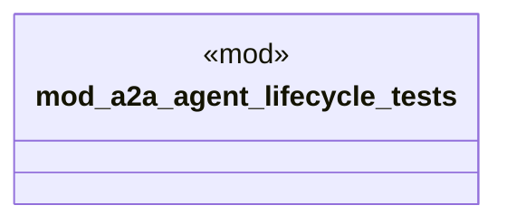

# `crates/ggen-cli/tests/a2a_agent_lifecycle.rs`

Source SHA-256: `5d136017ae9054e7ca3e3342a43f4882ae9fbf7374ef292ef285b92ee9aa6150`

## Dependencies

- `std::collections::HashMap`
- `std::time::{Duration, SystemTime}`

## Standing

- Structural parse: `ALIVE`
- Runtime behavior: `UNKNOWN`
