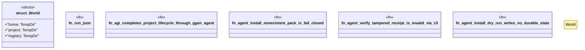

# `crates/ggen-cli/tests/agent_lifecycle_test.rs`

Source SHA-256: `784faede75d106dafcd103c2629a841bc1a91ce3c1e98fcc1d1f743675a2e7ea`

## Dependencies

- `assert_cmd::Command`
- `serde_json::Value`
- `std::fs`
- `std::path::Path`
- `tempfile::TempDir`

## Standing

- Structural parse: `ALIVE`
- Runtime behavior: `UNKNOWN`
