# `crates/ggen-cli/tests/chicago_tdd_critical_commands.rs`

Source SHA-256: `5e010d8ec5a14f30cd807138cea55e95a66b20b99b98666e27141876c4d16e2e`

```mermaid
classDiagram
    class fn_test_marketplace_lockfile_valid_json {
      <<fn>>
    }
    class fn_test_marketplace_manifest_required_fields {
      <<fn>>
    }
    class fn_test_marketplace_registry_prevents_duplicates {
      <<fn>>
    }
    class fn_test_project_init_creates_config {
      <<fn>>
    }
    class fn_test_project_name_validation {
      <<fn>>
    }
    class fn_test_project_template_valid_tera {
      <<fn>>
    }
    class fn_test_template_variable_substitution {
      <<fn>>
    }
    class fn_test_template_loop_basic {
      <<fn>>
    }
    class fn_test_template_conditional {
      <<fn>>
    }
    class fn_test_template_respects_existing_files {
      <<fn>>
    }
    class fn_test_template_force_overwrite {
      <<fn>>
    }
    class fn_test_template_creates_directories {
      <<fn>>
    }
    class fn_test_e2e_project_scaffold_and_generate {
      <<fn>>
    }
    class fn_test_e2e_install_and_list {
      <<fn>>
    }
```

## Dependencies

- `std::fs`
- `std::path::PathBuf`
- `tempfile::TempDir`

## Standing

- Structural parse: `ALIVE`
- Runtime behavior: `UNKNOWN`
