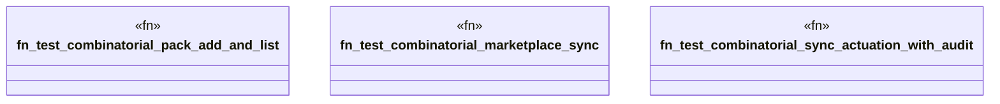

# `crates/ggen-cli/tests/chicago_tdd_working_capabilities.rs`

Source SHA-256: `90bdb692bc30c2a24cbd109babc2b400f43131c6f69dacc3e994e80f6cd26f03`

## Dependencies

- `assert_cmd::Command`
- `tempfile::TempDir`

## Standing

- Structural parse: `ALIVE`
- Runtime behavior: `UNKNOWN`
