# `crates/ggen-cli/tests/clap_noun_verb_integration.rs`

Source SHA-256: `25f093f2c4658aad95c954939f8390a78a5d88056d44ab23db8ef4c6c2ac1399`

```mermaid
classDiagram
    class fn_ggen {
      <<fn>>
    }
    class fn_test_ggen_help_shows_template_noun {
      <<fn>>
    }
    class fn_test_invalid_noun_returns_error {
      <<fn>>
    }
    class fn_test_invalid_verb_returns_error {
      <<fn>>
    }
    class fn_test_template_noun_in_main_help {
      <<fn>>
    }
    class fn_test_cli_version_flag {
      <<fn>>
    }
    class fn_create_cli_spec_ttl {
      <<fn>>
    }
    class fn_test_load_rdf_cli_definition {
      <<fn>>
    }
    class fn_test_rdf_spec_structure_valid {
      <<fn>>
    }
```

## Dependencies

- `assert_cmd::Command`
- `predicates::prelude::*`
- `std::fs`
- `std::path::PathBuf`
- `tempfile::TempDir`

## Standing

- Structural parse: `ALIVE`
- Runtime behavior: `UNKNOWN`
