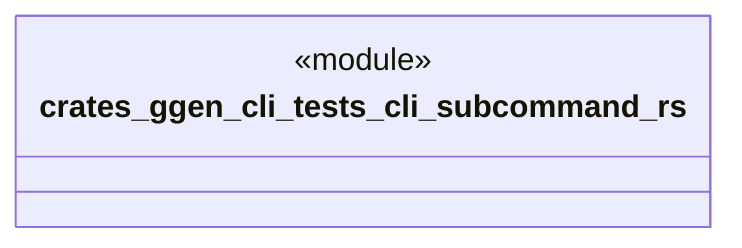

# `crates/ggen-cli/tests/cli_subcommand.rs`

Source SHA-256: `1bb87388dfb91bc07b7da55dbff68e8eca880478f62aa5960cb99e8cb8911c15`

## Dependencies

- None observed.

## Standing

- Structural parse: `ALIVE`
- Runtime behavior: `UNKNOWN`
