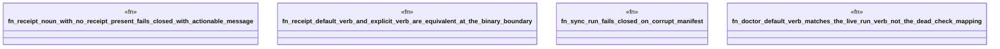

# `crates/ggen-cli/tests/cli_surface_evidence_test.rs`

Source SHA-256: `86df125c38a8310654bd91066eb8afbde344c8fbb132c029d47c2080ecccc990`

## Dependencies

- `assert_cmd::Command`
- `predicates::prelude::*`
- `tempfile::TempDir`

## Standing

- Structural parse: `ALIVE`
- Runtime behavior: `UNKNOWN`
