# `crates/ggen-cli/tests/construct_command_test.rs`

Source SHA-256: `5362cbe1e0f5f93e732098a6245617f617d734a2ad28136ca045b7a669e11c5c`

```mermaid
classDiagram
    class fn_test_construct_create_with_nonexistent_file {
      <<fn>>
    }
    class fn_test_construct_create_with_non_ttl_file {
      <<fn>>
    }
    class fn_test_construct_create_with_valid_ttl_file_returns_not_implemented {
      <<fn>>
    }
    class fn_test_construct_create_json_output_structure {
      <<fn>>
    }
    class fn_test_construct_validate_returns_not_implemented {
      <<fn>>
    }
    class fn_test_construct_validate_json_output_structure {
      <<fn>>
    }
    class fn_test_construct_create_with_custom_output_dir {
      <<fn>>
    }
    class fn_test_to_snake_case_conversion {
      <<fn>>
    }
```

## Dependencies

- `assert_cmd::Command`
- `assert_fs::prelude::*`
- `predicates::prelude::*`
- `serde_json::Value`

## Standing

- Structural parse: `ALIVE`
- Runtime behavior: `UNKNOWN`
