# `crates/ggen-cli/tests/default_verb_law_test.rs`

Source SHA-256: `ca07504b329901184826a531dbd904434a4fc9104e40a55111d2002cd207be74`

```mermaid
classDiagram
    class fn_strings {
      <<fn>>
    }
    class fn_generated_commands_default_verbs_table_declares_doctor_run {
      <<fn>>
    }
    class fn_generated_commands_inject_default_verbs_produces_the_reachable_doctor_run_verb {
      <<fn>>
    }
    class fn_sync_and_receipt_default_verbs_agree_with_the_live_lib_rs_mapping {
      <<fn>>
    }
    class fn_graph_and_unknown_nouns_are_not_rewritten_reproduced_against_generated_commands {
      <<fn>>
    }
```

## Dependencies

- `ggen_cli_lib::generated_commands::{default_verb, inject_default_verbs, DEFAULT_VERBS}`

## Standing

- Structural parse: `ALIVE`
- Runtime behavior: `UNKNOWN`
