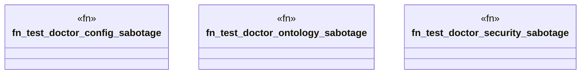

# `crates/ggen-cli/tests/doctor_adversarial_tests.rs`

Source SHA-256: `ee25b48aab339ea8d5779dc8528946bd53461ee3524175bda62b008bf4bed7de`

## Dependencies

- `assert_cmd::Command`
- `predicates::prelude::*`
- `std::fs`
- `tempfile::TempDir`

## Standing

- Structural parse: `ALIVE`
- Runtime behavior: `UNKNOWN`
