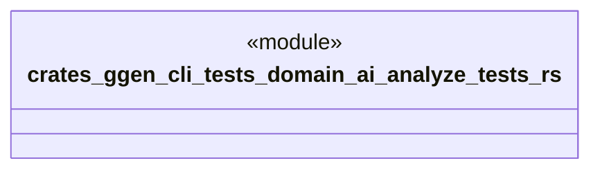

# `crates/ggen-cli/tests/domain/ai/analyze_tests.rs`

Source SHA-256: `2a4be953f08dea1ba298b9679d4758eb127b71b6d3e29f57ef2f78397c62139b`

## Dependencies

- `ggen_cli_lib::domain::ai::*`

## Standing

- Structural parse: `ALIVE`
- Runtime behavior: `UNKNOWN`
