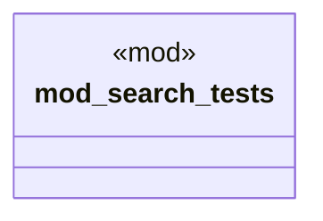

# `crates/ggen-cli/tests/domain/marketplace/mod.rs`

Source SHA-256: `10aa9424549ec3f06442f4d8d65afe0abe72dd6d4b9a3b6e794a42f22c49187d`

## Dependencies

- None observed.

## Standing

- Structural parse: `ALIVE`
- Runtime behavior: `UNKNOWN`
