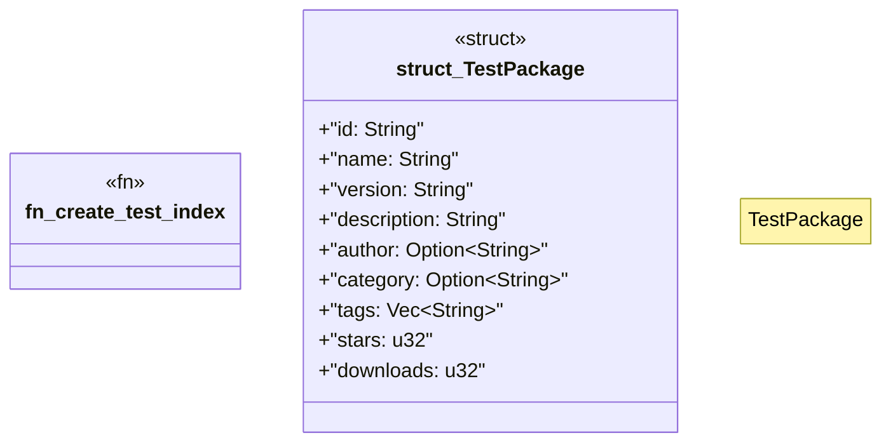

# `crates/ggen-cli/tests/domain/marketplace/search_tests.rs`

Source SHA-256: `7820ff9d76d5950963ec9c777a01bf9d9cd512c084f9b9d6e1fb169ed9c5b79d`

## Dependencies

- `ggen_cli_lib::domain::marketplace::{SearchFilters, SearchResult, search_packages}`
- `ggen_core::utils::error::Result`
- `serde_json`
- `std::fs`
- `std::path::{Path, PathBuf}`
- `tempfile::TempDir`

## Standing

- Structural parse: `ALIVE`
- Runtime behavior: `UNKNOWN`
