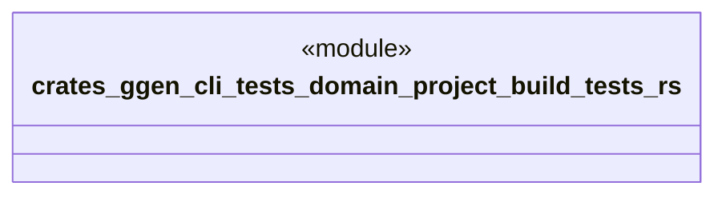

# `crates/ggen-cli/tests/domain/project/build_tests.rs`

Source SHA-256: `bfc81b84618788a1936f8b7e20bf1c3043502f9026113c3ea14dd9a5c84f4044`

## Dependencies

- `ggen_cli_lib::domain::project::*`
- `tempfile::TempDir`

## Standing

- Structural parse: `ALIVE`
- Runtime behavior: `UNKNOWN`
