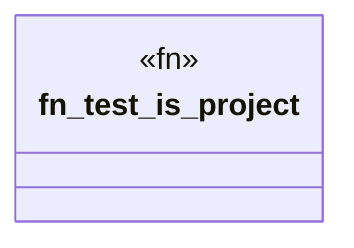

# `crates/ggen-cli/tests/domain/project/init_tests.rs`

Source SHA-256: `6d54106a8b291c5d29be09686160edd8831beacfec5ac66b3da09d535ae205cf`

## Dependencies

- `ggen_cli_lib::domain::project::*`
- `std::path::PathBuf`
- `tempfile::TempDir`

## Standing

- Structural parse: `ALIVE`
- Runtime behavior: `UNKNOWN`
