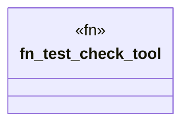

# `crates/ggen-cli/tests/domain/utils/doctor_tests.rs`

Source SHA-256: `8789ed9244a31fd120193aa6eb1b63371bab6adb67caaddf3d1cf655c1527c41`

## Dependencies

- `ggen_cli_lib::domain::utils::*`

## Standing

- Structural parse: `ALIVE`
- Runtime behavior: `UNKNOWN`
