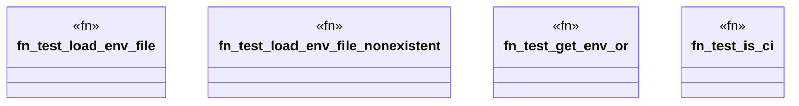

# `crates/ggen-cli/tests/domain/utils/env_tests.rs`

Source SHA-256: `29d5d6fd0b41ec94a48a7189e847a1dd0f9d9f1d7609fa2bb0fe9f006594c2ab`

## Dependencies

- `ggen_cli_lib::domain::utils::*`
- `std::io::Write`
- `tempfile::NamedTempFile`

## Standing

- Structural parse: `ALIVE`
- Runtime behavior: `UNKNOWN`
