# `crates/ggen-cli/tests/e2e.rs`

Source SHA-256: `59a011fbe42e4dcea1649a14b4f027169a8db38fe1a52a7e20fb910a2baf5603`

```mermaid
classDiagram
    class fn_e2e_template_generate_complete {
      <<fn>>
    }
    class fn_e2e_template_with_nested_structure {
      <<fn>>
    }
    class fn_e2e_marketplace_search_complete {
      <<fn>>
    }
    class fn_e2e_marketplace_search_with_filters {
      <<fn>>
    }
    class fn_e2e_marketplace_package_info {
      <<fn>>
    }
    class fn_e2e_marketplace_list_installed {
      <<fn>>
    }
    class fn_e2e_project_gen_complete {
      <<fn>>
    }
    class fn_e2e_project_with_git_init {
      <<fn>>
    }
    class fn_e2e_lifecycle_complete_workflow {
      <<fn>>
    }
    class fn_e2e_lifecycle_list_phases {
      <<fn>>
    }
    class fn_e2e_graph_import_and_query {
      <<fn>>
    }
    class fn_e2e_ai_generate_template {
      <<fn>>
    }
    class fn_e2e_scenario_new_microservice_project {
      <<fn>>
    }
    class fn_e2e_scenario_template_development {
      <<fn>>
    }
    class fn_e2e_recovery_invalid_template_graceful {
      <<fn>>
    }
    class fn_e2e_recovery_network_timeout_graceful {
      <<fn>>
    }
    class fn_e2e_performance_large_template {
      <<fn>>
    }
```

## Dependencies

- `assert_cmd::Command`
- `assert_fs::{prelude::*, TempDir}`
- `predicates::prelude::*`

## Standing

- Structural parse: `ALIVE`
- Runtime behavior: `UNKNOWN`
