# `crates/ggen-cli/tests/entry_point_integration.rs`

Source SHA-256: `40ff20b3085d8dd99281e6bfd5900d49b2489da4e75bb1e947a667fbf387e60c`

```mermaid
classDiagram
    class fn_test_cli_binary_exists_and_runs {
      <<fn>>
    }
    class fn_test_help_displays_auto_discovered_commands {
      <<fn>>
    }
    class fn_test_doctor_command_routes_correctly {
      <<fn>>
    }
    class fn_test_template_command_routes_correctly {
      <<fn>>
    }
    class fn_test_market_command_routes_correctly {
      <<fn>>
    }
    class fn_test_invalid_command_shows_error {
      <<fn>>
    }
    class fn_test_global_flags_work_before_command {
      <<fn>>
    }
    class fn_test_otel_flags_are_recognized {
      <<fn>>
    }
    class fn_test_config_flag_is_recognized {
      <<fn>>
    }
    class fn_test_manifest_path_flag_is_recognized {
      <<fn>>
    }
    class fn_test_commands_execute_with_real_binary {
      <<fn>>
    }
    class fn_test_help_progressive_command_exists {
      <<fn>>
    }
    class fn_test_auto_discovery_finds_all_command_modules {
      <<fn>>
    }
```

## Dependencies

- `assert_cmd::Command`
- `predicates::prelude::*`

## Standing

- Structural parse: `ALIVE`
- Runtime behavior: `UNKNOWN`
