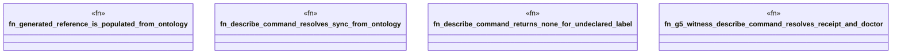

# `crates/ggen-cli/tests/generated_commands_reference.rs`

Source SHA-256: `20b8b9ce7dcf885f55ea0268986596f04c8f305c1dfef49216e8be508661094e`

## Dependencies

- `ggen_cli_lib::generated_commands::{describe_command, COMMANDS_REFERENCE}`

## Standing

- Structural parse: `ALIVE`
- Runtime behavior: `UNKNOWN`
