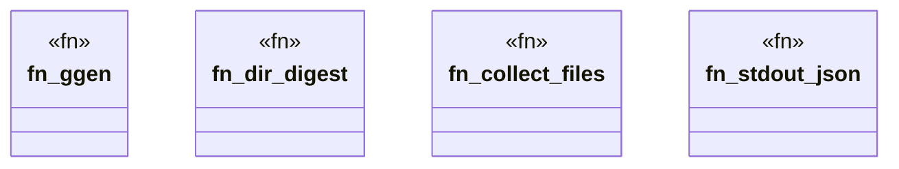

# `crates/ggen-cli/tests/init_bool_flag_regression_test.rs`

Source SHA-256: `99d6fa00021dbdf0bcf24631d9dd260200dad6ac917cf961da2fda5f39ac8a53`

## Dependencies

- `assert_cmd::Command`
- `serde_json::Value`
- `sha2::{Digest, Sha256}`
- `std::fs`
- `std::path::Path`
- `tempfile::TempDir`

## Standing

- Structural parse: `ALIVE`
- Runtime behavior: `UNKNOWN`
