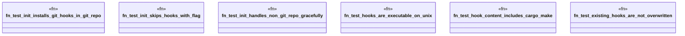

# `crates/ggen-cli/tests/init_git_hooks_test.rs`

Source SHA-256: `74962e8d8a879cc5b9f11ca803a3d82ce8c92aebbdd017c93dbd95bc0c6729d2`

## Dependencies

- `std::fs`
- `std::os::unix::fs::PermissionsExt`
- `tempfile::TempDir`

## Standing

- Structural parse: `ALIVE`
- Runtime behavior: `UNKNOWN`
