# `crates/ggen-cli/tests/integration/marketplace_tests.rs`

Source SHA-256: `679940f8056693a10a95aa26aa5fdc1dceea22fed90f0784e9b95bfdba339272`

```mermaid
classDiagram
    class fn_create_test_registry {
      <<fn>>
    }
    class fn_test_registry_search_functionality {
      <<fn>>
    }
    class fn_test_lockfile_crud_operations {
      <<fn>>
    }
    class fn_test_marketplace_workflow_end_to_end {
      <<fn>>
    }
    class fn_test_lockfile_concurrent_access {
      <<fn>>
    }
    class fn_test_registry_package_retrieval {
      <<fn>>
    }
    class fn_test_lockfile_persistence_format {
      <<fn>>
    }
    class fn_test_marketplace_error_handling {
      <<fn>>
    }
    class mod_production_readiness_tests {
      <<mod>>
    }
```

## Dependencies

- `assert_fs::prelude::*`
- `ggen_cli_lib::cmds::market::{lockfile::*, registry::*}`
- `std::fs`
- `super::*`
- `tempfile::TempDir`

## Standing

- Structural parse: `ALIVE`
- Runtime behavior: `UNKNOWN`
