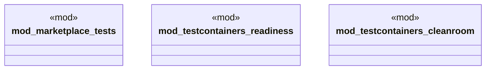

# `crates/ggen-cli/tests/integration/mod.rs`

Source SHA-256: `74b58c39be6b90a0070b70f61f3a1b1138e5e2e7183c543b2192ebf60dec5e4a`

## Dependencies

- None observed.

## Standing

- Structural parse: `ALIVE`
- Runtime behavior: `UNKNOWN`
