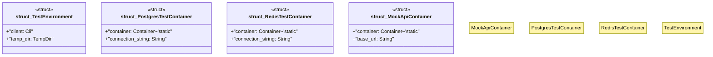

# `crates/ggen-cli/tests/integration/testcontainers_readiness.rs`

Source SHA-256: `ac56897fb955dfd8c0e2e2a495b0e9c727d126d80caa3dc6afcbf3330c46e3da`

## Dependencies

- `assert_cmd::prelude::*`
- `assert_fs::prelude::*`
- `predicates::prelude::*`
- `std::process::Command`
- `std::time::Duration`
- `tempfile::TempDir`
- `testcontainers::Container`
- `testcontainers::RunnableImage`
- `testcontainers::clients::Cli`
- `testcontainers::core::WaitFor`
- `testcontainers::images::generic::GenericImage`
- `testcontainers::images::postgres::PostgresImage`
- `testcontainers::images::redis::RedisImage`
- `tokio::time::sleep`

## Standing

- Structural parse: `ALIVE`
- Runtime behavior: `UNKNOWN`
