# `crates/ggen-cli/tests/integration_ai_e2e.rs`

Source SHA-256: `74cf79fdc69c621c04850f8b03d34e149e0859163cee24f4ff50553589f452f6`

```mermaid
classDiagram
    class fn_ggen {
      <<fn>>
    }
    class fn_test_ai_generate_executes {
      <<fn>>
    }
    class fn_test_ai_generate_with_language {
      <<fn>>
    }
    class fn_test_ai_generate_with_model {
      <<fn>>
    }
    class fn_test_ai_chat_executes {
      <<fn>>
    }
    class fn_test_ai_chat_interactive {
      <<fn>>
    }
    class fn_test_ai_analyze_executes {
      <<fn>>
    }
    class fn_test_ai_analyze_with_code {
      <<fn>>
    }
    class fn_test_ai_help_shows_verbs {
      <<fn>>
    }
    class fn_test_ai_generate_help {
      <<fn>>
    }
    class fn_test_ai_invalid_verb {
      <<fn>>
    }
```

## Dependencies

- `assert_cmd::Command`
- `predicates::prelude::*`
- `tempfile::TempDir`

## Standing

- Structural parse: `ALIVE`
- Runtime behavior: `UNKNOWN`
