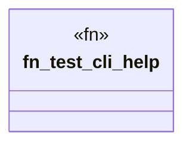

# `crates/ggen-cli/tests/integration_cli.rs`

Source SHA-256: `cdc4ea25b2a57d406f5e11cdeda866939b186b1315ef44222f94d2ecf93fa160`

## Dependencies

- `assert_cmd::Command`

## Standing

- Structural parse: `ALIVE`
- Runtime behavior: `UNKNOWN`
