# `crates/ggen-cli/tests/integration_graph_e2e.rs`

Source SHA-256: `01ade86665a4107c5fcad6e1abb8392776cb66f02f1e7e0f3367c49ed65a33bf`

```mermaid
classDiagram
    class fn_ggen {
      <<fn>>
    }
    class fn_create_test_rdf {
      <<fn>>
    }
    class fn_test_graph_load_turtle_format {
      <<fn>>
    }
    class fn_test_graph_load_invalid_format {
      <<fn>>
    }
    class fn_test_graph_query_sparql_select {
      <<fn>>
    }
    class fn_test_graph_query_invalid_sparql {
      <<fn>>
    }
    class fn_test_graph_export_turtle {
      <<fn>>
    }
    class fn_test_graph_validate_structure {
      <<fn>>
    }
    class fn_test_graph_stats_shows_metrics {
      <<fn>>
    }
    class fn_test_graph_snapshot_create {
      <<fn>>
    }
    class fn_test_graph_snapshot_list {
      <<fn>>
    }
    class fn_test_graph_diff_snapshots {
      <<fn>>
    }
    class fn_test_graph_help_output {
      <<fn>>
    }
    class fn_test_graph_query_help {
      <<fn>>
    }
    class fn_test_graph_invalid_verb {
      <<fn>>
    }
    class fn_test_graph_load_missing_file {
      <<fn>>
    }
    class fn_test_graph_export_missing_graph {
      <<fn>>
    }
    class fn_test_graph_performance_large_query {
      <<fn>>
    }
```

## Dependencies

- `assert_cmd::Command`
- `predicates::prelude::*`
- `std::fs`
- `tempfile::TempDir`

## Standing

- Structural parse: `ALIVE`
- Runtime behavior: `UNKNOWN`
