# `crates/ggen-cli/tests/integration_marketplace_e2e.rs`

Source SHA-256: `62be23dee0537c1afd9bcf1aca80798d14b130dec68ac9ce04963778fdfbb210`

```mermaid
classDiagram
    class fn_ggen {
      <<fn>>
    }
    class fn_create_test_cache {
      <<fn>>
    }
    class fn_test_marketplace_search_basic {
      <<fn>>
    }
    class fn_test_marketplace_search_with_category {
      <<fn>>
    }
    class fn_test_marketplace_search_json_output {
      <<fn>>
    }
    class fn_test_marketplace_list_empty {
      <<fn>>
    }
    class fn_test_marketplace_list_json {
      <<fn>>
    }
    class fn_test_marketplace_info_missing_package {
      <<fn>>
    }
    class fn_test_marketplace_remove_not_installed {
      <<fn>>
    }
    class fn_test_marketplace_categories_list {
      <<fn>>
    }
    class fn_test_marketplace_cache_clean {
      <<fn>>
    }
    class fn_test_marketplace_cache_status {
      <<fn>>
    }
    class fn_test_marketplace_lockfile_generate {
      <<fn>>
    }
    class fn_test_marketplace_registry_info {
      <<fn>>
    }
    class fn_test_marketplace_offline_sync {
      <<fn>>
    }
    class fn_test_marketplace_help_output {
      <<fn>>
    }
    class fn_test_marketplace_search_help {
      <<fn>>
    }
    class fn_test_marketplace_invalid_verb {
      <<fn>>
    }
    class fn_test_marketplace_recommend_basic {
      <<fn>>
    }
    class fn_test_marketplace_recommend_with_category {
      <<fn>>
    }
    class fn_test_marketplace_update_all {
      <<fn>>
    }
    class fn_test_marketplace_sync_basic {
      <<fn>>
    }
```

## Dependencies

- `assert_cmd::Command`
- `predicates::prelude::*`
- `std::fs`
- `tempfile::TempDir`

## Standing

- Structural parse: `ALIVE`
- Runtime behavior: `UNKNOWN`
