# `crates/ggen-cli/tests/integration_ontology_e2e.rs`

Source SHA-256: `414765f0fbc7a192d92788d66a0147e1ed36c33c54075d5690e7123b88054fdc`

```mermaid
classDiagram
    class fn_ggen {
      <<fn>>
    }
    class fn_create_test_ontology {
      <<fn>>
    }
    class fn_test_ontology_init_creates_project {
      <<fn>>
    }
    class fn_test_ontology_validate_passes {
      <<fn>>
    }
    class fn_test_ontology_validate_strict {
      <<fn>>
    }
    class fn_test_ontology_generate_creates_code {
      <<fn>>
    }
    class fn_test_ontology_generate_with_output {
      <<fn>>
    }
    class fn_test_ontology_generate_with_zod {
      <<fn>>
    }
    class fn_test_ontology_generate_with_utilities {
      <<fn>>
    }
    class fn_test_ontology_help_shows_verbs {
      <<fn>>
    }
    class fn_test_ontology_invalid_verb {
      <<fn>>
    }
    class fn_test_ontology_validate_missing_file {
      <<fn>>
    }
    class fn_test_ontology_generate_missing_file {
      <<fn>>
    }
```

## Dependencies

- `assert_cmd::Command`
- `predicates::prelude::*`
- `std::fs`
- `tempfile::TempDir`

## Standing

- Structural parse: `ALIVE`
- Runtime behavior: `UNKNOWN`
