# `crates/ggen-cli/tests/integration_project_e2e.rs`

Source SHA-256: `f1dc2574acb49857bfcee1c32637212d97341196b097681fce7a1c069e364c54`

```mermaid
classDiagram
    class fn_ggen {
      <<fn>>
    }
    class fn_test_project_new_creates_project {
      <<fn>>
    }
    class fn_test_project_new_with_custom_output {
      <<fn>>
    }
    class fn_test_project_init_creates_structure {
      <<fn>>
    }
    class fn_test_project_init_with_preset {
      <<fn>>
    }
    class fn_test_project_plan_generates_plan {
      <<fn>>
    }
    class fn_test_project_gen_creates_files {
      <<fn>>
    }
    class fn_test_project_gen_dry_run {
      <<fn>>
    }
    class fn_test_project_help_shows_verbs {
      <<fn>>
    }
    class fn_test_project_invalid_verb {
      <<fn>>
    }
    class fn_test_project_new_invalid_type {
      <<fn>>
    }
    class fn_test_project_init_empty_name {
      <<fn>>
    }
    class fn_test_project_init_whitespace_name {
      <<fn>>
    }
```

## Dependencies

- `assert_cmd::Command`
- `predicates::prelude::*`
- `std::fs`
- `tempfile::TempDir`

## Standing

- Structural parse: `ALIVE`
- Runtime behavior: `UNKNOWN`
