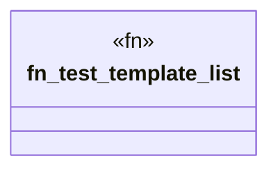

# `crates/ggen-cli/tests/integration_template.rs`

Source SHA-256: `f72d757963d2b06aedde76627c2d164bfe72f4c90db933312de4ac2b1eaf1f47`

## Dependencies

- `assert_cmd::Command`

## Standing

- Structural parse: `ALIVE`
- Runtime behavior: `UNKNOWN`
