# `crates/ggen-cli/tests/integration_template_e2e.rs`

Source SHA-256: `01f9d52f5af6e27010c544b5fc4635c0458d853209455e47f7b77b74ca773767`

```mermaid
classDiagram
    class fn_ggen {
      <<fn>>
    }
    class fn_create_test_template {
      <<fn>>
    }
    class fn_test_template_new_creates_structure {
      <<fn>>
    }
    class fn_test_template_list_empty {
      <<fn>>
    }
    class fn_test_template_list_shows_installed {
      <<fn>>
    }
    class fn_test_template_list_json_format {
      <<fn>>
    }
    class fn_test_template_show_displays_details {
      <<fn>>
    }
    class fn_test_template_show_missing_template {
      <<fn>>
    }
    class fn_test_template_lint_valid_template {
      <<fn>>
    }
    class fn_test_template_lint_invalid_syntax {
      <<fn>>
    }
    class fn_test_template_generate_tree_basic {
      <<fn>>
    }
    class fn_test_template_regenerate_basic {
      <<fn>>
    }
    class fn_test_template_help_output {
      <<fn>>
    }
    class fn_test_template_new_help {
      <<fn>>
    }
    class fn_test_template_invalid_verb {
      <<fn>>
    }
    class fn_test_template_new_with_description {
      <<fn>>
    }
    class fn_test_template_generate_tree_missing_template {
      <<fn>>
    }
    class fn_test_template_performance_list {
      <<fn>>
    }
```

## Dependencies

- `assert_cmd::Command`
- `predicates::prelude::*`
- `std::fs`
- `tempfile::TempDir`

## Standing

- Structural parse: `ALIVE`
- Runtime behavior: `UNKNOWN`
