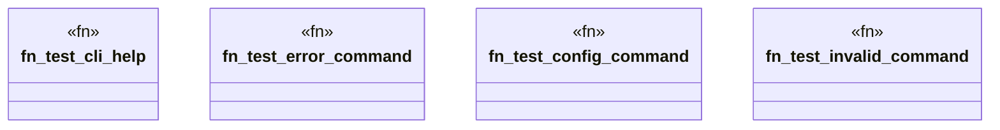

# `crates/ggen-cli/tests/integration_tests.rs`

Source SHA-256: `7d95b52caba8c783bf2c5e3350016f53c2c5b27783796ee69f7fbb40da7dfed2`

## Dependencies

- `std::process::Command`
- `std::str`

## Standing

- Structural parse: `ALIVE`
- Runtime behavior: `UNKNOWN`
