# `crates/ggen-cli/tests/integration_utils_e2e.rs`

Source SHA-256: `f2c9e408a7ae5a4d458f6a76df70ad65bbdd880410f130dbedd00d29fcfbd8dd`

```mermaid
classDiagram
    class fn_ggen {
      <<fn>>
    }
    class fn_test_utils_doctor_runs {
      <<fn>>
    }
    class fn_test_utils_doctor_all {
      <<fn>>
    }
    class fn_test_utils_doctor_env_format {
      <<fn>>
    }
    class fn_test_utils_doctor_json_format {
      <<fn>>
    }
    class fn_test_utils_env_lists {
      <<fn>>
    }
    class fn_test_utils_env_get {
      <<fn>>
    }
    class fn_test_utils_env_set {
      <<fn>>
    }
    class fn_test_utils_help_shows_verbs {
      <<fn>>
    }
    class fn_test_utils_doctor_help {
      <<fn>>
    }
    class fn_test_utils_invalid_verb {
      <<fn>>
    }
    class fn_test_utils_doctor_checks_system_tools {
      <<fn>>
    }
    class fn_test_utils_doctor_reports_health_status {
      <<fn>>
    }
```

## Dependencies

- `assert_cmd::Command`
- `predicates::prelude::*`
- `tempfile::TempDir`

## Standing

- Structural parse: `ALIVE`
- Runtime behavior: `UNKNOWN`
