# `crates/ggen-cli/tests/integration_workflow_e2e.rs`

Source SHA-256: `63cfd69c70ea0925132f77c63909b60750be286aed83658bae58eb80ddce03a9`

```mermaid
classDiagram
    class fn_ggen {
      <<fn>>
    }
    class fn_create_test_workflow {
      <<fn>>
    }
    class fn_test_workflow_init_creates_workflow {
      <<fn>>
    }
    class fn_test_workflow_init_with_type {
      <<fn>>
    }
    class fn_test_workflow_init_with_output_dir {
      <<fn>>
    }
    class fn_test_workflow_analyze {
      <<fn>>
    }
    class fn_test_workflow_analyze_summary {
      <<fn>>
    }
    class fn_test_workflow_discover {
      <<fn>>
    }
    class fn_test_workflow_discover_pareto {
      <<fn>>
    }
    class fn_test_workflow_discover_export_mermaid {
      <<fn>>
    }
    class fn_test_workflow_event {
      <<fn>>
    }
    class fn_test_workflow_event_with_resource {
      <<fn>>
    }
    class fn_test_workflow_report {
      <<fn>>
    }
    class fn_test_workflow_report_html_format {
      <<fn>>
    }
    class fn_test_workflow_report_json_format {
      <<fn>>
    }
    class fn_test_workflow_help_shows_verbs {
      <<fn>>
    }
    class fn_test_workflow_invalid_verb {
      <<fn>>
    }
    class fn_test_workflow_analyze_missing_file {
      <<fn>>
    }
```

## Dependencies

- `assert_cmd::Command`
- `predicates::prelude::*`
- `std::fs`
- `tempfile::TempDir`

## Standing

- Structural parse: `ALIVE`
- Runtime behavior: `UNKNOWN`
