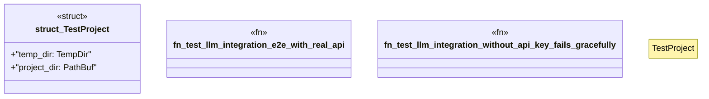

# `crates/ggen-cli/tests/llm_e2e_test.rs`

Source SHA-256: `eb1bc2f20da615e92e02741978962135bab18b5b0ed5aa955a2fdf5c7300ae92`

## Dependencies

- `std::fs`
- `std::path::PathBuf`
- `std::process::Command`
- `tempfile::TempDir`

## Standing

- Structural parse: `ALIVE`
- Runtime behavior: `UNKNOWN`
