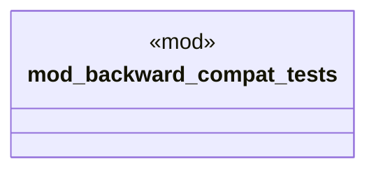

# `crates/ggen-cli/tests/marketplace/integration/backward_compat_test.rs`

Source SHA-256: `43f59203b258971d4104976e2c136bf876aaeea8d192362d355c678efa63cd57`

## Dependencies

- `std::process::Command`
- `std::thread`
- `std::time::Instant`
- `tempfile::TempDir`

## Standing

- Structural parse: `ALIVE`
- Runtime behavior: `UNKNOWN`
