# `crates/ggen-cli/tests/marketplace/integration/cli_commands_test.rs`

Source SHA-256: `6ac59e1ffd1f324e2309467d61e8a2a7b1e92fe6afd80fe7014110a2534c1360`

```mermaid
classDiagram
    class fn_test_marketplace_list_command {
      <<fn>>
    }
    class fn_test_marketplace_list_with_json_output {
      <<fn>>
    }
    class fn_test_marketplace_search_with_query {
      <<fn>>
    }
    class fn_test_marketplace_search_with_limit {
      <<fn>>
    }
    class fn_test_marketplace_search_with_category_filter {
      <<fn>>
    }
    class fn_test_marketplace_search_empty_query_fails {
      <<fn>>
    }
    class fn_test_marketplace_maturity_command {
      <<fn>>
    }
    class fn_test_marketplace_maturity_detailed_flag {
      <<fn>>
    }
    class fn_test_marketplace_maturity_verify_production {
      <<fn>>
    }
    class fn_test_marketplace_maturity_verify_beta {
      <<fn>>
    }
    class fn_test_marketplace_dashboard_command {
      <<fn>>
    }
    class fn_test_marketplace_dashboard_with_output_file {
      <<fn>>
    }
    class fn_test_marketplace_dashboard_filter_production {
      <<fn>>
    }
    class fn_test_marketplace_validate_single_package {
      <<fn>>
    }
    class fn_test_marketplace_validate_all_packages {
      <<fn>>
    }
    class fn_test_marketplace_validate_require_production {
      <<fn>>
    }
    class fn_test_marketplace_validate_improvement_plan {
      <<fn>>
    }
    class fn_test_marketplace_export_json {
      <<fn>>
    }
```

## Dependencies

- `assert_cmd::Command`
- `predicates::prelude::*`
- `std::fs`
- `tempfile::TempDir`

## Standing

- Structural parse: `ALIVE`
- Runtime behavior: `UNKNOWN`
