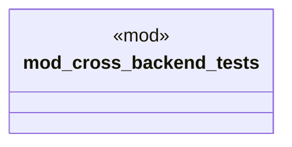

# `crates/ggen-cli/tests/marketplace/integration/cross_backend_test.rs`

Source SHA-256: `68ab1f2dddb65503182a2eeb0b0969a5098b3a4e6a4f375957f7e03aef2ed479`

## Dependencies

- `chrono::Utc`
- `ggen_core::marketplace::Package as V1Package`
- `ggen_core::marketplace::{MaturityLevel, PackageMetadata as V1Meta}`
- `ggen_marketplace_v2::models::Package as V2Package`
- `ggen_marketplace_v2::models::{PackageId, PackageMetadata as V2Meta, PackageVersion}`
- `std::time::Instant`

## Standing

- Structural parse: `ALIVE`
- Runtime behavior: `UNKNOWN`
