# `crates/ggen-cli/tests/marketplace/integration/edge_cases_test.rs`

Source SHA-256: `760f8f2eede65c47cf9d00b46ea39ebbea7a1682393c86cda8486516986941a6`

```mermaid
classDiagram
    class fn_test_empty_query_validation {
      <<fn>>
    }
    class fn_test_whitespace_only_query {
      <<fn>>
    }
    class fn_test_special_characters_in_query {
      <<fn>>
    }
    class fn_test_unicode_in_query {
      <<fn>>
    }
    class fn_test_very_long_query {
      <<fn>>
    }
    class fn_test_invalid_package_name {
      <<fn>>
    }
    class fn_test_nonexistent_package {
      <<fn>>
    }
    class fn_test_zero_limit {
      <<fn>>
    }
    class fn_test_negative_limit {
      <<fn>>
    }
    class fn_test_huge_limit {
      <<fn>>
    }
    class fn_test_invalid_maturity_level {
      <<fn>>
    }
    class fn_test_invalid_export_format {
      <<fn>>
    }
    class fn_test_compare_same_package {
      <<fn>>
    }
    class fn_test_compare_nonexistent_packages {
      <<fn>>
    }
    class fn_test_invalid_use_case {
      <<fn>>
    }
    class fn_test_concurrent_search_requests {
      <<fn>>
    }
    class fn_test_concurrent_maturity_assessments {
      <<fn>>
    }
    class fn_test_sql_injection_attempts {
      <<fn>>
    }
    class fn_test_path_traversal_attempts {
      <<fn>>
    }
    class fn_test_null_bytes_in_input {
      <<fn>>
    }
    class fn_test_extremely_nested_json_output {
      <<fn>>
    }
    class fn_test_invalid_score_threshold {
      <<fn>>
    }
    class fn_test_negative_score_threshold {
      <<fn>>
    }
```

## Dependencies

- `assert_cmd::Command`
- `predicates::prelude::*`
- `std::sync::{Arc, Mutex}`
- `std::thread`

## Standing

- Structural parse: `ALIVE`
- Runtime behavior: `UNKNOWN`
