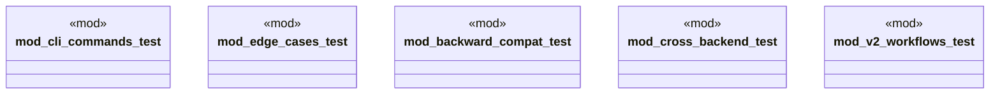

# `crates/ggen-cli/tests/marketplace/integration/mod.rs`

Source SHA-256: `ff28a3e76f3fa6cd12988c5f14020ab8b37f681be29e7d782397fa829f9df592`

## Dependencies

- None observed.

## Standing

- Structural parse: `ALIVE`
- Runtime behavior: `UNKNOWN`
