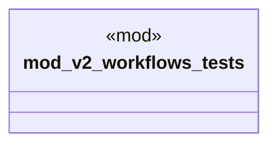

# `crates/ggen-cli/tests/marketplace/integration/v2_workflows_test.rs`

Source SHA-256: `f00e2c6a03687929327972e87702e25020fa82fc3c7570d0bad4101a2213ac69`

## Dependencies

- `chrono::Utc`
- `ggen_marketplace_v2::models::{Package, PackageId, PackageMetadata, PackageVersion}`
- `ggen_marketplace_v2::prelude::*`
- `ggen_marketplace_v2::security::SignatureManager`
- `oxigraph::store::Store`
- `std::sync::Arc`
- `std::time::Instant`
- `tokio::task`

## Standing

- Structural parse: `ALIVE`
- Runtime behavior: `UNKNOWN`
