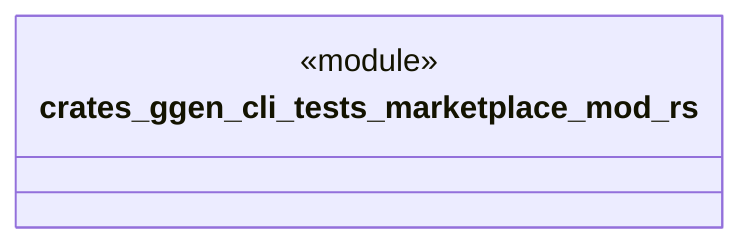

# `crates/ggen-cli/tests/marketplace/mod.rs`

Source SHA-256: `555b0796ea3014220db055412cde7aee687a7527b659303ca06010d659f50c28`

## Dependencies

- None observed.

## Standing

- Structural parse: `ALIVE`
- Runtime behavior: `UNKNOWN`
