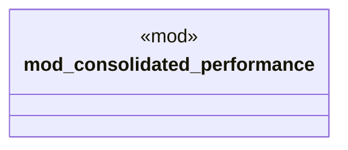

# `crates/ggen-cli/tests/marketplace/performance/mod.rs`

Source SHA-256: `a74ba709a126864852cf95ac07789d729bf74ec4ed7cf0434fc81a40a192197a`

## Dependencies

- None observed.

## Standing

- Structural parse: `ALIVE`
- Runtime behavior: `UNKNOWN`
